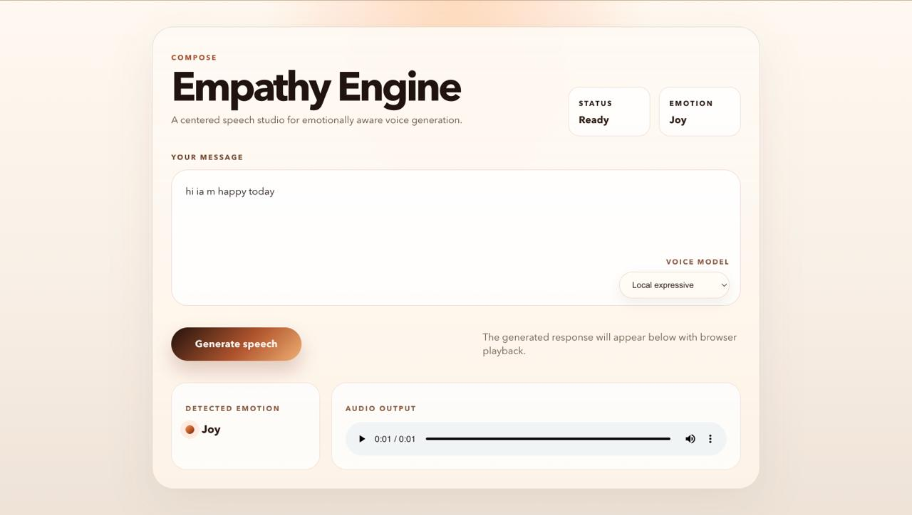

# Empathy Engine

Empathy Engine is a full-stack text-to-speech project that turns plain text into more expressive spoken audio.
It supports two selectable speech models:

- `Local expressive`: emotion-aware local speech generation using `pyttsx3`
- `Google Neural`: cloud speech generation using Google Text-to-Speech

The frontend provides a centered single-page studio UI where users can type a message, choose a model, generate speech, and play the result in the browser.

## Project Structure

```text
EmpathyEngine/
├── backend/
│   ├── app/
│   │   ├── config.py
│   │   ├── main.py
│   │   ├── routes/
│   │   │   ├── tts_google.py
│   │   │   └── tts_routes.py
│   │   └── services/
│   │       ├── emotion.py
│   │       ├── mapper.py
│   │       ├── text_enhancer.py
│   │       └── tts.py
│   ├── .env.example
│   ├── requirements.txt
│   └── static/audio/
└── empathy-frontend/
    ├── src/
    │   ├── App.tsx
    │   ├── App.css
    │   └── index.css
    ├── package.json
    └── vite.config.ts
```

## Core Logic

### Shared flow

1. The frontend sends input text to a backend speech endpoint.
2. The backend detects emotion using a Hugging Face transformer model.
3. The text is enhanced with punctuation and pause shaping.
4. The selected TTS model generates audio into `backend/static/audio/`.
5. The frontend requests the generated file through `GET /get-audio`.
6. The browser plays the returned audio blob inside the UI.

### Local expressive model

The local path:

- uses `POST /speak`
- maps emotion to `rate` and `volume`
- adds small random variation for a more human feel
- keeps the normal local system voice without emotion-based voice switching
- generates a local audio file using `pyttsx3`
- converts playback to browser-safe `wav` when needed

### Google Neural model

The Google path:

- uses `POST /speak/google`
- generates `mp3` using Google Cloud Text-to-Speech
- reads credentials from `backend/.env`
- serves `mp3` playback directly when the file is already browser-safe

## Important Files

- [backend/app/services/emotion.py](/Users/lokii/Documents/EmpathyEngine/EmpathyEngine/backend/app/services/emotion.py:1)
  Detects emotion and confidence score.
- [backend/app/services/text_enhancer.py](/Users/lokii/Documents/EmpathyEngine/EmpathyEngine/backend/app/services/text_enhancer.py:1)
  Adds emotional text shaping and pauses.
- [backend/app/services/mapper.py](/Users/lokii/Documents/EmpathyEngine/EmpathyEngine/backend/app/services/mapper.py:1)
  Maps emotion to local expressive speaking parameters.
- [backend/app/services/tts.py](/Users/lokii/Documents/EmpathyEngine/EmpathyEngine/backend/app/services/tts.py:1)
  Generates local expressive speech audio.
- [backend/app/routes/tts_routes.py](/Users/lokii/Documents/EmpathyEngine/EmpathyEngine/backend/app/routes/tts_routes.py:1)
  Handles the local expressive route and playback file serving.
- [backend/app/routes/tts_google.py](/Users/lokii/Documents/EmpathyEngine/EmpathyEngine/backend/app/routes/tts_google.py:1)
  Handles the Google Neural route and credential-driven client setup.
- [empathy-frontend/src/App.tsx](/Users/lokii/Documents/EmpathyEngine/EmpathyEngine/empathy-frontend/src/App.tsx:1)
  Provides the centered single-page UI and model selection dropdown.

## Tech Stack

### Backend

- FastAPI
- Uvicorn
- Transformers
- Hugging Face emotion model: `j-hartmann/emotion-english-distilroberta-base`
- `pyttsx3`
- Google Cloud Text-to-Speech

### Frontend

- React
- TypeScript
- Vite
- Axios

## Requirements

### Backend

- Python 3.11 recommended
- macOS is currently the best-fit environment for the local playback conversion path because it uses `afconvert`

### Frontend

- Node.js 18+ recommended
- npm

## Environment Variables

The backend reads environment variables from `backend/.env`.

### Required

```env
HF_TOKEN=your_huggingface_token_here
```

### Google model credentials

Use either of these:

```env
GOOGLE_APPLICATION_CREDENTIALS=/absolute/path/to/service-account.json
```

or

```env
GOOGLE_API_KEY=your_google_api_key
```

Notes:

- `GOOGLE_APPLICATION_CREDENTIALS` is the more standard and reliable option
- `GOOGLE_API_KEY` is supported by the current code as a fallback
- the template file is [backend/.env.example](/Users/lokii/Documents/EmpathyEngine/EmpathyEngine/backend/.env.example:1)

## Setup

### Backend

From the project root:

```bash
cd backend
python3 -m venv .venv
source .venv/bin/activate
pip install -r requirements.txt
cp .env.example .env
```

Then edit `backend/.env` and fill in:

- `HF_TOKEN`
- `GOOGLE_APPLICATION_CREDENTIALS` or `GOOGLE_API_KEY` if you want the Google model

### Frontend

From the project root:

```bash
cd empathy-frontend
npm install
```

## Run the Project

Open two terminals.

### Terminal 1: backend

```bash
cd backend
source .venv/bin/activate
uvicorn app.main:app --reload
```

Backend URL:

```text
http://localhost:8000
```

### Terminal 2: frontend

```bash
cd empathy-frontend
npm run dev
```

Frontend URL:

```text
http://localhost:5173
```

## Build Commands

### Frontend build

```bash
cd empathy-frontend
npm run build
```

### Frontend preview

```bash
cd empathy-frontend
npm run preview
```

## API Endpoints

### `POST /speak`

Local expressive speech generation.

Example:

```bash
curl -X POST "http://localhost:8000/speak?text=I%20am%20so%20happy%20to%20see%20you"
```

Example response:

```json
{
  "input_text": "Wow! I am so happy to see you!",
  "emotion": "joy",
  "confidence": 0.981,
  "rate": 238,
  "volume": 1.27,
  "audio_file": "example-file.wav"
}
```

### `POST /speak/google`

Google Neural speech generation.

Example:

```bash
curl -X POST "http://localhost:8000/speak/google?text=I%20am%20so%20happy%20to%20see%20you"
```

Example response:

```json
{
  "input_text": "Wow! I am so happy to see you!",
  "emotion": "joy",
  "confidence": 0.981,
  "audio_file": "example-file.mp3",
  "provider": "google",
  "playback_format": "mp3"
}
```

### `GET /get-audio`

Returns the generated file in a browser-playable format.

Query parameters:

- `filename`
- `format`: `wav` or `mp3`

Examples:

```bash
curl "http://localhost:8000/get-audio?filename=example-file.wav&format=wav" --output playback.wav
```

```bash
curl "http://localhost:8000/get-audio?filename=example-file.mp3&format=mp3" --output playback.mp3
```

## Frontend UI

The frontend is now a centered single-page speech studio with:

- one main chat-style composer in the center
- model selection dropdown inside the message box at the bottom-right
- local expressive and Google Neural model switching
- emotion display and audio playback area on the same screen

Important note:

- [empathy-frontend/src/App.tsx](/Users/lokii/Documents/EmpathyEngine/EmpathyEngine/empathy-frontend/src/App.tsx:1) currently hardcodes `http://localhost:8000` as the backend URL

## UI Preview

<p align="center">
  
</p>

## Adding a UI Screenshot to README

The easiest way is:

1. Save the image inside the repo, for example:
   `empathy-frontend/public/ui-preview.png`
2. Add this markdown to `README.md`:

```md
## UI Preview


```

If you want a centered image with HTML instead, use:

```html
<p align="center">
  
</p>
```

Recommended:

- use a `.png`
- keep the file name simple, like `ui-preview.png`
- store it in a tracked folder inside the repo

## Known Notes

- generated audio files are written into `backend/static/audio/`
- generated audio files are runtime artifacts and should not be committed
- local expressive playback still uses conversion for browser compatibility
- Google `mp3` playback is usually served directly when no conversion is needed
- the project currently uses permissive CORS for development

## Troubleshooting

### Backend does not start

Check:

- the virtual environment is activated
- dependencies are installed
- `HF_TOKEN` exists in `backend/.env`

### Google model does not work

Check:

- `GOOGLE_APPLICATION_CREDENTIALS` path is valid, or `GOOGLE_API_KEY` is set
- Google Cloud Text-to-Speech is enabled in your Google project
- the backend was restarted after editing `.env`

### Audio file is generated but browser does not play it

Check:

- backend is running on `http://localhost:8000`
- frontend model selection matches the intended path
- local expressive uses `wav` playback
- Google Neural uses `mp3` playback

### Frontend cannot reach backend

Check:

- backend is running before frontend requests are made
- `API_BASE_URL` in the frontend still matches your backend URL
